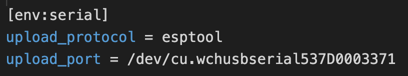

# Operame

Dit is de broncode van de firmware voor de [ControlCO2-meter](https://controlco2.space), operame project origineel gestart door RevSpace. Hier is op verder bebouwd door studenten van UCLL die dit project kregen als eindwerk. De inhoud van deze repository dient enkel om de juist code op het sensor te zetten. Dat is ook waarom we enkel omschrijven hoe je de code op de sensor zet. Indien je op zoek bent naar hoe je de sensor instelt bekijk dan [Hier](https://github.com/Wolkjes/frontend) hoe dit moet.

## Language

The default language is Dutch; users can pick a different language using the
WiFi configuration portal. To change the default setting to English, change
`#define LANGUAGE "nl"` to `#define LANGUAGE "en"`.

## Gebruik

### Installatie

Deze repository gebruikt [PlatformIO](https://platformio.org/) voor installatie.

1. Installeer PlatformIO.
2. Kloon deze repository lokaal.
3. Ga in de commandline of terminal naar de map van deze repository en voer `pio run` uit.

## Tips

Indien het bord niet gevonden wordt, controleer of je de cp210x USB TO UART drivers van silicon labs hebt geinstalleerd.
https://www.silabs.com/developers/usb-to-uart-bridge-vcp-drivers
  
## Ervaring van een windows 10 gebruiker  
-windows 10 systeem

-visual studio code installeren

-platformio 2.3.2 extensie geinstalleerd (issue met 2.3.3) in VS code.

-python 3.9 geinstalleerd, zorg dat add to path aangevinkt is

-git installeren om repository te clonen

-bordje connecteren en in devices checken of driver er is anders cp210x driver van silicon lans installeren.

-dan in platformio.ini upload_port en flags commenten. zoek port dan automatisch

## Ervaring van een mac gebruiker (m1 en intel)
-visual studio code installeren

-platformio extensie geïnstalleerd in VS code.
<ul>
    <li>platformio extensie geïnstalleerd in VS code.</li>
    <li>git clone deze repository</li>
    <li>bordje connecteren en kijken of hij kan verbinen</li>
    <li>Werkte niet: had niet gezien dat er een driver link was in deze readme</li>
    <li>Uiteindelijk deze driver gevonden die werkt: <a href="https://dsc.cloud/d5c41b/CH9102_Mac_Driver_2.zip">https://dsc.cloud/d5c41b/CH9102_Mac_Driver_2.zip</a></li>
    <li>Voeg een default upload_port toe bij de platoformio.ini file 
    </li>
</ul>

## Add sensor

First update your sensor to the latest version: [https://github.com/Wolkjes/operame]

Then connect your sensor to the network and enter the correct IP-address:
<ol>
    <li>Turn the sensor on</li>
    <li>The sensor makes a wifi connection, connect to this with another device</li>
    <li>Then you will get a message to login on this wifi connection, open this and the configuration page will open in the browser</li>
    <li>Select the correct SSID of the password and enter the password of that SSID</li>
    <li>Enter the correct ip-address in the MQTT ip address box. This is the ip where you run all the server files (docker-compose file)</li>
    <li>Go to the bottom of the page and click on Save</li>
    <li>Then restart your sensor by clicking restart at the top of the page</li>
</ol>

